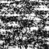

# SAR-report
By: Chen Yang

Code.R is the code can run in R platform

document.tex is the report in tex format

document.pdf is the report in pdf

chose [1500:1599 ,1500:1599] urban area for analyze:

